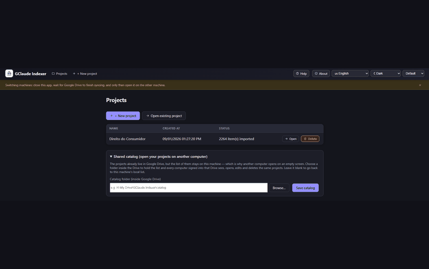
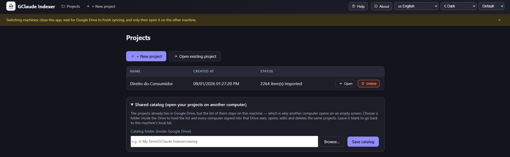
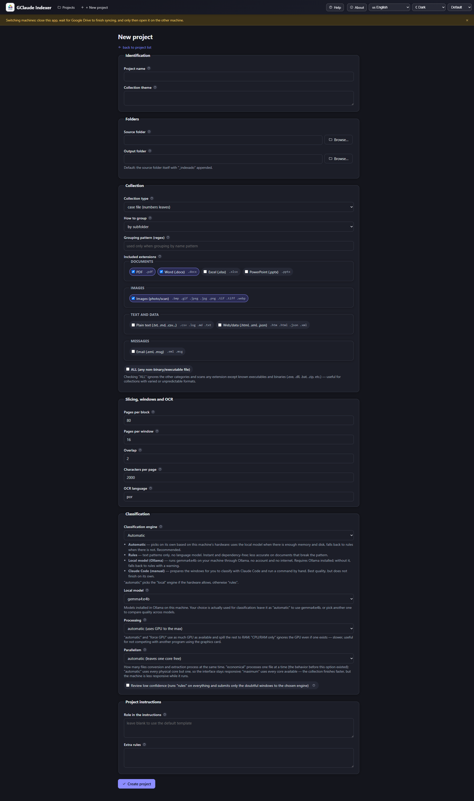
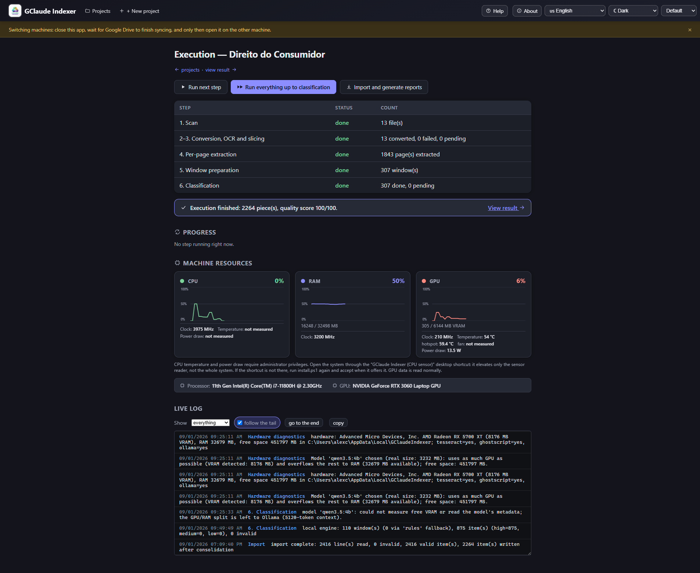
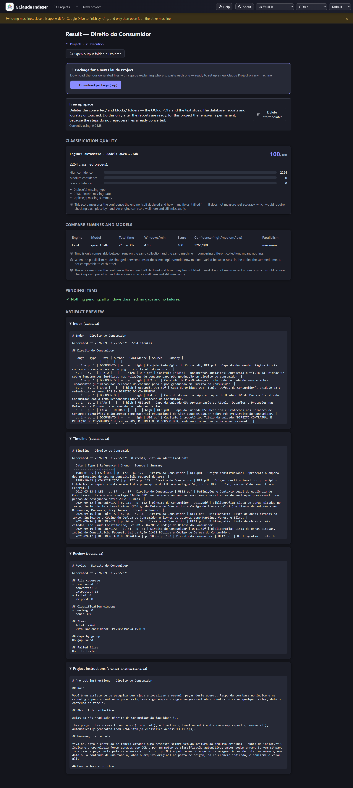

**Leia no seu idioma:** Português (Brasil) — você está aqui · **[English](../README.md)** · **[Español](README.es.md)**

# GClaude Indexer

Uma ferramenta local e offline que transforma uma pasta cheia de documentos
num índice pesquisável, numa cronologia e em instruções prontas para um
projeto no Claude.

O Google Drive hospeda os arquivos; o projeto no Claude os consulta através
do índice.



*Uma primeira execução, na ordem em que você a encontra — projetos, novo
projeto, execução, resultado. A atualização de uma coleção, adicionada
depois, é descrita abaixo.*

## O que o sistema faz

Aponte o GClaude Indexer para uma pasta de documentos — PDFs escaneados,
Word, Excel, PowerPoint, imagens, e-mails, texto puro, praticamente
qualquer coisa — e ele varre a pasta, aplica OCR nas páginas escaneadas sem
camada de texto, fatia PDFs grandes demais em blocos legíveis e lê cada
página. Em seguida classifica o conteúdo em itens individuais (cada um com
um tipo, uma data quando é possível encontrá-la, um autor e um resumo
curto) e grava de volta quatro arquivos em Markdown: um **índice** de cada
item, uma **cronologia** ordenada por data, um relatório de **conferência**
listando lacunas e falhas, e um conjunto de **instruções de projeto**
prontas para colar num novo projeto no Claude. Os documentos originais
nunca são alterados — tudo que a ferramenta produz são arquivos novos,
gravados ao lado dos originais, numa pasta de saída separada que você
escolhe.

Uma coleção raramente está terminada. Quando documentos são adicionados à
pasta de origem, corrigidos ou retirados dela, o aplicativo detecta o que
mudou e reprocessa só isso — adicionar um documento a uma coleção de 500
páginas reclassifica uma janela em vez de trinta e seis, cerca de um
minuto em vez de dezoito e meia. Ele mostra o que encontrou e quanto isso
vai custar antes de tocar em qualquer coisa.

A classificação — a etapa que decide o que cada página é, quem escreveu e
quando — pode ser feita de quatro formas diferentes, descritas abaixo. Três
dessas quatro nunca saem da sua máquina. Todas as demais etapas (varredura,
OCR, extração por página, fatiamento, geração dos quatro relatórios) rodam
sempre inteiramente local, não importa qual motor de classificação você
escolha.

## Destaques

- **Offline por design.** Com exceção do motor opcional `claude_code` (veja
  abaixo), o GClaude Indexer nunca envia um documento, uma página de texto
  ou sequer um nome de arquivo pela rede. Isso importa mais para quem
  trabalha com acervo sensível ou confidencial — nada sai da máquina, a
  menos que você escolha explicitamente o único motor que sai.
- **Só roda no Windows.** O aplicativo conversa diretamente com interfaces
  específicas do Windows — PowerShell, WMI (para detecção de hardware e
  monitoramento de recursos), o registro do Windows (para a localização dos
  dados do Tesseract e detecção de idioma) e o subsistema de Performance
  Counters (para os gráficos ao vivo de CPU/GPU). Não roda em Linux nem
  macOS.
- **Atualizações incrementais.** Uma coleção já indexada absorve
  documentos novos, editados e removidos sem precisar ser processada de
  novo do zero. Só o que a mudança realmente afeta é refeito, e você vê
  quanto isso vai custar antes de confirmar.
- **Interface em três idiomas** — português do Brasil, inglês e espanhol,
  selecionáveis a qualquer momento num menu no cabeçalho da página. O
  padrão é detectado automaticamente a partir do idioma de exibição do seu
  Windows.
- **Nenhum instalador é necessário no dia a dia.** Depois da preparação
  única abaixo, um atalho na área de trabalho abre o aplicativo com um
  duplo clique. Nada é compilado num único `.exe`; continua sendo script
  Python e PowerShell simples e legível.
- **Licenciado sob a GNU GPL-3.0.** Veja [Licença](#licença) abaixo para o
  que isso implica se você pretende modificar ou redistribuir este
  software.

*As capturas mostram a interface em inglês; ela também está disponível em
português e espanhol.*



*Projetos — todas as coleções indexadas nesta máquina, mais o catálogo
compartilhado opcional que permite abrir os mesmos projetos em outro
computador.*



*Novo projeto — pastas, tipos de arquivo, fatiamento de PDF, idioma do OCR e
motor de classificação, tudo numa tela só.*



*Execução — as seis etapas com contagens ao vivo, gráficos de CPU/RAM/GPU
lidos da própria máquina e um log que acompanha o final.*



*Resultado — nota de qualidade, comparação entre os motores executados sobre
esta coleção e prévia dos quatro arquivos gerados.*

## Requisitos

- **Windows 10 ou 11.** Obrigatório — veja [Destaques](#destaques) acima
  para o motivo.
- **Python 3.12** — instalado para você se estiver faltando. Este projeto
  fixa versões de dependências que os Python mais novos (3.13, 3.14)
  quebram, então o instalador procura a 3.12 e, quando a máquina não a tem,
  baixa e instala a 3.12.10 oficial para o usuário atual: sem
  administrador, sem passo manual, e qualquer outro Python já instalado na
  máquina fica exatamente onde está.
- Para **OCR** (documentos escaneados sem camada de texto): Tesseract e
  Ghostscript. O instalador abaixo instala os dois automaticamente quando
  possível.
- Para o **motor de classificação `local`** (o padrão recomendado):
  [Ollama](https://ollama.com), instalado automaticamente pelo instalador
  abaixo se você aceitar. Uma GPU com alguns gigabytes de VRAM livre acelera
  bastante este motor, mas não é obrigatória — o Ollama usa o máximo de
  memória de GPU que couber e transborda o resto para a RAM do sistema
  sozinho. Como referência aproximada, o modelo local padrão (`qwen3.5:4b`)
  tem cerca de 3,2 GB para baixar, e precisa de um pouco mais que isso
  somando VRAM e RAM para rodar — ele cabe numa placa de 6 GB tão folgado
  quanto numa de 8 GB; uma máquina com pouco dos dois cai automaticamente
  para o motor `rules` (veja [Motores de classificação](#motores-de-classificação)
  abaixo), com uma explicação exibida na tela.
- O **motor `rules`** não precisa de nada do que está acima — roda em
  qualquer máquina Windows capaz de rodar Python, sem GPU, sem download e
  sem software extra.
- Alguns gigabytes de espaço livre em disco para o ambiente Python e, se
  você usar, o modelo local do Ollama.

## Instalando (primeira vez numa máquina)

Você não precisa de Git, de uma conta no GitHub, nem de experiência com
programação para isto. Você precisa conseguir abrir uma pasta no
Explorador de Arquivos e rodar um comando num terminal — os dois passos são
explicados abaixo.

**Jeito mais fácil — o instalador do Windows.** Baixe o
`GClaude-Indexer-Setup-1.3.3.exe` na
[versão mais recente](https://github.com/alexccastilho/gclaude-indexer/releases/latest)
e dê dois cliques. Ele pergunta onde instalar (só para você ou para
todos os usuários da máquina), mostra a licença, deixa você marcar quais
dependências quer, e baixa e instala todas — Python 3.12, Tesseract com
o idioma português, Ghostscript, Ollama e o modelo de classificação —
com barra de progresso e sem abrir nenhuma janela de terminal.
Desinstalar é pelo Configurações > Aplicativos, como qualquer programa,
e ele pergunta uma a uma quais dependências compartilhadas devem sair
junto.

O SmartScreen do Windows vai avisar antes de executar: o instalador não
é assinado digitalmente, porque um certificado custa dinheiro que este
projeto não tem. Clique em "Mais informações" e depois em "Executar
assim mesmo". Você pode conferir o que baixou pelo SHA-256 publicado
junto de cada versão.

**Sem o instalador:** execute o `Indexer.bat` e siga as instruções. É o
caminho descrito no resto desta página, e funciona também numa máquina
onde você não pode instalar programas.

---

**1. Coloque o código-fonte na sua máquina.** Se você baixou este projeto
como um arquivo `.zip`, clique com o botão direito nele e escolha "Extrair
tudo…", depois escolha uma pasta comum (por exemplo, dentro de Documentos
ou uma pasta sincronizada pelo Google Drive montado com letra de unidade).
Se você já clonou com Git, já tem uma pasta — de qualquer forma, lembre onde
ela está; o resto destas instruções chama essa pasta de "a pasta do
projeto".

**2. Abra o PowerShell dentro da pasta do projeto.** No Explorador de
Arquivos, abra a pasta do projeto e então:
- segure **Shift**, clique com o botão direito num espaço vazio dentro da
  pasta e escolha "Abrir janela do PowerShell aqui" (ou "Abrir no
  Terminal"), ou
- clique na barra de endereço, digite `powershell` e pressione Enter.

Abre uma janela azul ou escura — este é o PowerShell, já "dentro" da pasta
do projeto.

**3. Você não precisa instalar o Python.** O instalador do passo 4 faz
isso: este projeto precisa do Python 3.12 especificamente (as versões de
pacote que ele fixa não compilam em versões mais novas) e, se a sua
máquina não tiver, o instalador baixa o 3.12 oficial do python.org —
versão exata, checksum conferido — e instala dentro da sua própria pasta
de usuário. Esse passo não pede administrador.

Ele é instalado *ao lado* de qualquer outro Python que você tenha, não por
cima. Se hoje `python --version` mostra 3.13 ou 3.14, vai continuar
mostrando a mesma coisa depois: o seu comando `python`, as associações de
arquivo e o menu Iniciar ficam exatamente como estão.

Se preferir instalar por conta própria antes, é o mesmo que o instalador
faz:

```powershell
winget install --id Python.Python.3.12 -e --scope user --silent --accept-package-agreements --accept-source-agreements
```

**4. Rode o instalador uma vez.** Ele instala o Python 3.12 se estiver
faltando, cria um ambiente Python privado para este aplicativo (fora da
pasta do projeto, para sobreviver a uma mudança de pasta ou a uma nova
sincronização do Google Drive/OneDrive), instala os pacotes Python
necessários, confere Tesseract e Ghostscript (instalando-os se estiverem
faltando e você concordar) e oferece criar um atalho na área de trabalho.

```powershell
powershell -ExecutionPolicy Bypass -File install.ps1
```

O Windows pode mostrar um aviso de segurança na primeira vez que você roda
qualquer script PowerShell baixado da internet ("O Windows protegeu o
computador") — isso é normal; a opção `-ExecutionPolicy Bypass` acima já
avisa o PowerShell para rodar este script mesmo assim, sem mudar nenhuma
configuração permanente da sua máquina.

Enquanto roda, o instalador mostra o progresso e pede confirmação antes de
instalar qualquer coisa (Tesseract, Ghostscript e, opcionalmente, o Ollama
e seu modelo padrão, que é um download grande). Se algum passo falhar, ele
mostra o comando manual que você pode rodar sozinho como alternativa. Esta
primeira execução pode levar vários minutos, a maior parte gasta baixando
pacotes.

**5. Aceite a oferta de criar o atalho na área de trabalho** no final, se
quiser um — é a forma mais fácil de abrir o aplicativo depois.

Em seguida o instalador oferece um *segundo* atalho, opcional, chamado
"GClaude Indexer (CPU sensor)". Aceite só se quiser ver temperatura e
consumo da CPU na tela de execução: essas duas leituras exigem privilégio
de administrador, então esse atalho faz o Windows pedir administrador toda
vez que você abrir o aplicativo. Todo o resto — inclusive temperatura,
consumo e frequência da GPU — funciona sem ele. Recusar é uma resposta
perfeitamente boa, e dá para mudar de ideia depois rodando
`install.ps1 -CpuSensorShortcut`.

## Rodando no dia a dia

Depois de instalado, dê duplo clique no atalho da área de trabalho. Ele
abre uma janela parecida com o Prompt de Comando só na primeira vez (caso
o instalador ainda precise rodar); depois disso, sobe o aplicativo sem
nenhuma janela visível e abre o navegador padrão em:

```
http://127.0.0.1:8000
```

O servidor só escuta em `127.0.0.1` — a sua própria máquina — e nunca fica
acessível pela rede nem por nenhum outro computador.

Se preferir não usar o atalho, a partir da pasta do projeto:

```powershell
python launcher.py
```

Isso faz a mesma coisa que o instalador faz — confere o ambiente, instala
o que estiver faltando — antes de subir o servidor, então também funciona
como um comando "simplesmente funcione" numa máquina onde você ainda não
rodou o instalador.

Para fechar o aplicativo, feche a janela do terminal que ele abriu (ou, se
estiver rodando oculto via o atalho, encontre `pythonw.exe` no Gerenciador
de Tarefas e finalize-o).

### O sensor de CPU, opcional

Se você aceitou o atalho "GClaude Indexer (CPU sensor)", abri-lo faz o
Windows pedir administrador. O que sobe com privilégio **não** é o
aplicativo: é um processo auxiliar pequeno, cuja única função é ler os
sensores e devolver os números. O servidor, a indexação e os seus
documentos continuam rodando sem privilégio nenhum, e o auxiliar fecha
junto com o aplicativo.

Responder **Não** a esse pedido é seguro e não custa mais nada: o sistema
abre exatamente como abriria pelo atalho comum, mostrando temperatura,
consumo e frequência da GPU, e "não medido" nos dois sensores da CPU. Nada
falha, e nenhum erro aparece.

## Desinstalando

Dê um duplo clique no `Desinstalar.bat`, na pasta do projeto — a mesma do
`Indexer.bat`. Pelo prompt, qualquer um dos dois:

```powershell
.\Desinstalar.bat
powershell -ExecutionPolicy Bypass -File uninstall.ps1
```

**Por que não simplesmente `.\uninstall.ps1`?** O Google Drive marca todo
arquivo que sincroniza como se tivesse vindo da internet, e a política de
execução padrão do Windows (RemoteSigned) recusa rodar um `.ps1` dessa zona
sem assinatura digital — "o arquivo não está assinado digitalmente". Não há
nada errado com o script: o `Desinstalar.bat` apenas passa
`-ExecutionPolicy Bypass` naquela execução, que é o que todos os outros
lançadores deste projeto já fazem. Rodar o `install.ps1` também limpa essa
marca dos scripts da pasta, e aí o comando direto passa a funcionar.

Ele pergunta item por item, e a resposta padrão é sempre **não**. Separa o
que esta instalação tem como seu — o ambiente virtual, os atalhos, as
bibliotecas de sensores, as configurações locais, as entradas de PATH e as
variáveis de ambiente que ele criou — dos programas comuns que ele apenas
instalou para você: Tesseract, Ghostscript, Ollama, Python e os modelos
baixados do Ollama. Outros programas da sua máquina podem estar usando
esses, então cada um é oferecido separadamente, dizendo isso com todas as
letras.

**Ele nunca apaga os seus projetos.** As pastas de saída, seus bancos de
dados, os PDFs com OCR e os relatórios gerados são seus documentos, não
sobras de instalação. O script lista onde eles estão, com o tamanho de
cada um, e deixa a decisão com você.

Três opções cobrem os usos não interativos:

```powershell
powershell -ExecutionPolicy Bypass -File uninstall.ps1 -WhatIfOnly        # mostra o plano, não remove nada
powershell -ExecutionPolicy Bypass -File uninstall.ps1 -KeepDependencies  # mantém Tesseract, Ghostscript, Ollama, Python
powershell -ExecutionPolicy Bypass -File uninstall.ps1 -RemoveAll         # diz sim a tudo (menos aos seus projetos)
```

A pasta do próprio projeto é sincronizada pelo Google Drive e nunca é
tocada: apague-a por lá se quiser que ela suma de todos os computadores.

## Usando o aplicativo

A interface tem cinco telas, mais uma página "Sobre":

1. **Projetos** — lista todos os projetos que você já abriu, com data de
   criação e situação atual. É onde você cai ao abrir o aplicativo. No
   rodapé fica o **Catálogo compartilhado**: aponte-o para uma pasta
   dentro do seu Google Drive e todo computador com o mesmo Drive passa a
   ver, abrir, editar e excluir os mesmos projetos. Sem ele, a *lista* de
   projetos fica só nesta máquina, mesmo com os projetos sincronizados —
   é por isso que outro computador mostraria a tela vazia. Projetos
   guardados no disco local de outro computador aparecem marcados como
   fora de alcance. O **Abrir projeto existente**, ao lado de "Novo
   projeto", recebe uma pasta que você aponta e reabre o projeto que
   estiver nela — para uma reinstalação, uma máquina nova, uma pasta que
   você moveu ou que alguém lhe mandou. Nada é recriado: a pasta de saída
   já guarda o projeto inteiro, e ele é usado exatamente como está.
2. **Novo projeto** — um formulário onde você escolhe uma pasta de origem
   (os documentos), uma pasta de saída (onde os resultados vão), quais
   tipos de arquivo incluir, como os documentos devem ser agrupados e qual
   motor de classificação usar. Todo campo já vem com um padrão sensato
   preenchido e uma dica "?" ao lado do rótulo.
3. **Execução** — uma linha por etapa de processamento (varredura,
   conversão, extração por página, preparação de janelas, classificação),
   cada uma com um botão "rodar esta etapa", uma barra de progresso com
   estimativa de tempo, e um botão de pausa. Abaixo, um log ao vivo e um
   gráfico de uso de CPU/RAM/GPU. Um botão separado, "Importar e gerar
   relatórios", roda as duas últimas etapas (transformando os itens
   classificados nos quatro arquivos de saída) assim que a classificação
   termina. Se a pasta de origem mudou desde a última execução, um aviso
   aparece no topo pouco depois que a página carrega, com um link para a
   próxima tela.
4. **Atualizar coleção** — alcançada a partir desse aviso, ou diretamente.
   Lista os documentos novos, editados e removidos, nomeia os que serão
   reprocessados e informa o custo: quantos arquivos passam pelo OCR de
   novo, quantas janelas são reclassificadas e quantas mantêm a
   classificação que já têm. Nada é alterado até você confirmar. Se a
   pasta de origem não puder ser lida — um disco desconectado, uma pasta
   que foi movida — a tela avisa isso e não oferece nada, porque uma pasta
   inacessível nunca deve ser confundida com uma coleção cujos documentos
   foram todos apagados.
5. **Resultado** — uma prévia dos quatro arquivos gerados, um botão para
   abrir a pasta de saída direto no Explorador de Arquivos, um relatório do
   que ainda está pendente, e um botão para liberar espaço em disco
   apagando os arquivos intermediários (os PDFs com OCR e os fatiamentos de
   texto) quando você já estiver satisfeito com o resultado — o banco de
   dados, os quatro relatórios e os logs nunca são tocados por isso.

Um seletor de idioma e um seletor de tema (quatro temas de cor) ficam no
cabeçalho de toda tela; as duas escolhas são lembradas no seu navegador
entre visitas.

## Mantendo uma coleção atualizada

Uma coleção muda. Chegam documentos, um escaneamento é trocado por um
melhor, algo é retirado. Nada disso exige indexar tudo de novo.

Abra o projeto. Alguns segundos depois que a tela Execução aparece, se
algo mudou na pasta de origem, um aviso diz o quanto — "14 novos, 3
editados, 1 removido". Siga-o até a tela **Atualizar coleção**, veja o
que ela planeja fazer e confirme. Depois rode as etapas como de costume:
elas vão encontrar só o trabalho que a atualização deixou para elas.

**Uma etapa não faz parte de "rodar todas as etapas".** Transformar os itens
classificados nos quatro arquivos Markdown é um botão separado — "Importar e
gerar relatórios" — na mesma tela Execução. A classificação terminar não os
grava. Pular essa etapa deixa os relatórios descrevendo a coleção como ela
era antes, o que é tão confuso quanto parece. Agora o aplicativo avisa:
assim que não sobra mais nada para processar, aparece um aviso com o botão
nele, e a tela Resultado diz claramente quando os arquivos exibidos são
anteriores ao projeto e o que mudou desde então.

**Quanto isso custa, e por que não é a coleção inteira.** Os documentos
são agrupados, e as páginas de um grupo são lidas como uma única
sequência longa, fatiada em janelas sobrepostas — as janelas são o que o
motor de classificação de fato lê. Uma mudança não invalida um
documento; ela invalida o grupo a partir da primeira página que se
deslocou em diante. Tudo antes desse ponto mantém suas páginas e sua
classificação intactas. Por isso um documento adicionado no fim de um
grupo custa quase nada, enquanto um inserido no início desloca toda
página depois dele e custa mais. A tela diz em qual dos dois casos você
está, antes de você confirmar.

Documentos que só precisam de renumeração não passam pelo OCR de novo —
os arquivos convertidos ainda estão em disco e são simplesmente relidos.
Só um documento cujo próprio conteúdo mudou paga esse custo.

**Se você limpou os arquivos intermediários** na tela Resultado, os
arquivos convertidos deixam de existir, e os documentos que seriam
relidos precisam ser convertidos de novo. A atualização trata isso
corretamente; só demora mais.

**Se a pasta de origem não puder ser alcançada** — o disco está
desconectado, a pasta foi movida ou renomeada — nada é oferecido e nada
é alterado. Uma pasta inacessível não é uma coleção cujos documentos
foram todos apagados, e o aplicativo não vai tratá-la como se fosse.

## Conseguindo uma boa classificação

Dois campos decidem mais sobre o resultado do que qualquer outra coisa, e os
dois são fáceis de errar porque nada obriga você a pensar neles.

**Preencha o Assunto e o Tipo de acervo no formulário de Novo projeto.**
Eles não são enfeite: o motor `local` mostra esses campos ao modelo, e são
eles que dizem a ele *que tipo de documento ele está lendo*. Um acervo de
material didático descrito só com os padrões acaba classificado contra
exemplos genéricos, e o modelo responde corretamente "não sei" para quase
todo tipo. Escrever uma frase sobre o acervo — o que é, de onde veio, que
documentos tem — é a coisa mais eficaz que você pode fazer pelo resultado.
As "Instruções de papel" e as "Regras adicionais" também são repassadas,
como contexto sobre o acervo.

**Qual modelo usar.** Medido neste projeto, sobre as mesmas janelas de um
documento de 31 páginas, com todos os modelos rodando inteiramente numa
placa de 8 GB:

| Modelo | Tamanho | Tipo preenchido | s/janela |
|---|---:|---:|---:|
| **`qwen3.5:4b`** (padrão) | **3,0 GB** | **100%** | **30,8** |
| `gemma4:e4b` | 3,1 GB | 79,5% | 38,5 |
| `qwen3.5:9b` | 5,3 GB | 79,5% | 86,2 |
| `qwen3:8b` | 5,4 GB | 100% | 108,8 |
| `granite4.2:8b` | 5,7 GB | 100% | 116,9 |

O `qwen3.5:4b` alcança a mesma qualidade do melhor deles em um quarto do
tempo e com metade da VRAM, e cabe numa placa de 6 GB tão folgado quanto
numa de 8 GB — uma configuração só para todas as máquinas. É o padrão desde
a versão 1.0.1; antes disso o padrão era o `gemma4:e4b`, que continua
selecionável aqui para quem quiser comparar. Repare que o
modelo maior da mesma família perdeu para o menor: descrever uma página é
leitura e disciplina de formato, não raciocínio profundo, então tamanho não
compra qualidade aqui e custa tempo.

**Escolha um modelo que caiba na sua placa de vídeo.** O que não cabe na
VRAM o Ollama roda na CPU, e a diferença não é sutil. Na máquina em que isto
foi medido — placa de 8 GB — um modelo de 9,1 GB rodou com 17% de si na GPU;
um de 5 GB rodou inteiro na GPU. A tela de Execução mostra a VRAM da sua
placa, a tela "Sobre" lista os modelos instalados, e o log avisa quando o
modelo escolhido não cabe. Menor costuma ser a troca certa: um modelo que
cabe e termina vale mais que um maior que passa a execução inteira
transbordando.

Se a nota de qualidade parecer baixa, abra o log: ele agora informa como a
GPU está sendo usada e, na tela de Resultado, a nota vem decomposta em
confiança, preenchimento de campos e penalidades, para você ver qual dos
três está custando.

### O que o índice garante

Duas propriedades valem independentemente de quão bem o modelo faça o
trabalho dele, porque o código as impõe em vez de pedi-las.

**Toda página chega ao índice.** Uma página que o modelo nunca mencionou
ainda assim ganha uma entrada — com a referência dela, o arquivo e o
próprio texto como resumo — porque o agrupamento percorre as páginas da
janela, não a resposta do modelo. Uma peça que não passa na validação é
descartada, mas as páginas que ela cobria são retomadas como entrada de
confiança baixa, em vez de sumirem junto. Um índice que omite uma página
em silêncio é pior que índice nenhum: o que falta é invisível.

**As datas mantêm a precisão que o documento de fato tem.** Documentos
datados por período — "competência 01/2020", "exercício 2019" — são
guardados como `2020-01` e `2019`, e não completados até um primeiro dia
do mês que a página nunca afirmou. A ISO 8601 admite a forma reduzida, e
ela continua ordenando corretamente no `timeline.md`. Uma data cujo dia
não existe (`2021-09-31`) cai para o mês; texto que não é data nenhuma
deixa o campo vazio, e a peça mantém todo o resto.

### Janelas, blocos e OCR

**Páginas por janela** é o campo que decide a qualidade: é quantas páginas
vão em cada pedido ao modelo, e ele responde com uma linha por página. **8
é o valor recomendado.** Com 16, só a resposta passa de 3.500 tokens e
começa a ser truncada — foi a causa de todos os resultados ruins medidos
durante o ajuste. Com 4, você triplica o número de pedidos sem ganho.

**Páginas por bloco** *não* afeta o índice. Ele só corta PDFs muito grandes
em arquivos auxiliares dentro de `saída/blocks/`, que nada mais lê e que o
botão "liberar espaço" apaga. Deixe em 80; reduza apenas se um PDF muito
grande (500+ páginas) fizer a conversão faltar memória.

**OCR** só se aplica a PDFs sem camada de texto — o sistema detecta isso
arquivo a arquivo e pula quando o texto já existe. Aí o que importa é o
`ocr_language` corresponder aos seus documentos.

## Motores de classificação

A classificação — decidir o que cada página é, quem escreveu e quando — é a
única etapa de todo o pipeline em que você escolhe *como* o trabalho é
feito. Todo o resto do pipeline (varredura, OCR, extração, geração dos
relatórios) é idêntico não importa qual motor você escolha aqui.

| Motor | Custo | Sai da máquina? | Precisa de |
|---|---|---|---|
| `rules` | gratuito | não | nada — roda em qualquer máquina Windows |
| `local` | gratuito | não | Ollama, instalado automaticamente; mais rápido com GPU, funciona sem uma |
| `claude_code` | sua assinatura já existente do Claude Code | **sim** | Claude Code já instalado nesta máquina |
| `automatic` | — | — | escolhe `local` se o hardware aguentar, senão cai em `rules`; nunca escolhe `claude_code` sozinho |

**O `claude_code` é inteiramente opcional.** O GClaude Indexer funciona do
início ao fim sem ele, usando `rules` ou `local` — nenhum dos dois precisa
de nada além do que o instalador já prepara. Escolha `claude_code` só se
você já usa o Claude Code e especificamente quer a classificação feita por
ele; nesse caso, o aplicativo prepara os arquivos e mostra um comando para
colar no Claude Code, e depois importa o resultado assim que o Claude Code
terminar.

O `rules` é um motor determinístico — procura marcadores conhecidos de tipo
de documento, padrões de data e blocos de assinatura, sem nenhum modelo de
aprendizado de máquina envolvido, então o resultado é totalmente
reproduzível e não precisa de nenhuma instalação. O `local` usa um modelo
aberto servido pelo [Ollama](https://ollama.com) na sua própria máquina
(`http://127.0.0.1:11434`, nunca um endereço remoto) e geralmente produz
resultados melhores que o `rules`, ao custo do espaço em disco, do download
e (opcionalmente) da GPU listados em [Requisitos](#requisitos).

Uma opção "revisar itens de confiança baixa" também está disponível no
formulário de Novo Projeto: ela roda o `rules` em tudo, depois reprocessa
só os itens de confiança baixa por um segundo motor à sua escolha — um meio
termo entre o custo zero do `rules` e a precisão maior de um motor mais
caro só nas páginas que realmente precisam dele.

## Arquivos de saída

Gravados na pasta de saída que você escolheu, sempre no idioma em que a
interface estiver no momento em que você os gerar:

- `index.md` — um catálogo de cada item classificado, com origem, tipo,
  data, autor e resumo.
- `timeline.md` — os itens datados em ordem cronológica.
- `review.md` — um relatório de cobertura: lacunas, falhas, o que ainda
  está pendente, e os documentos que foram removidos da pasta de origem,
  com o momento em que cada um saiu. O índice e a cronologia descrevem a
  coleção como ela está hoje; é aqui que você descobre o que costumava
  estar nela.
- `project_instructions.md` — instruções prontas para colar num novo
  projeto no Claude, montadas a partir de um modelo com os campos que você
  preencheu no formulário de Novo Projeto.

A tela Resultado também oferece um pacote `.zip` contendo esses quatro
arquivos mais um guia curto, no tamanho certo para colar direto num
projeto novo do Claude.

## OCR e idioma dos documentos

Por padrão, o OCR do Tesseract usa português (`por`) em projetos novos,
já que este projeto nasceu para acervos documentais em português do
Brasil.

O pacote do Tesseract para Windows traz apenas `eng` e `osd`, então o
`install.ps1` baixa e instala o idioma para o qual o projeto está
configurado (`por`, por padrão) na pasta `tessdata` do Tesseract. Ele pede
elevação ao Windows só para essa cópia de arquivo, e confere o SHA-256 antes
de instalar.

Se o seu acervo estiver em outro idioma, mude o campo "Idioma do OCR" no
formulário de Novo Projeto para o código correspondente do Tesseract (por
exemplo, `eng` para inglês ou `spa` para espanhol) e instale o pacote de
dados desse idioma rodando o instalador com o código que você precisa:

```powershell
powershell -ExecutionPolicy Bypass -File install.ps1 -OcrLanguage spa
```

O instalador só instala idiomas cujo SHA-256 ele tem fixado — hoje `por`,
`eng`, `spa` e `osd`. Ele nunca baixa um arquivo que não consegue conferir;
para qualquer outro idioma, ele mostra onde pegar o arquivo e onde colocá-lo,
e segue em frente.

## Rodando a suíte de testes

Se você está contribuindo com mudanças, ou só quer confirmar que tudo
funciona depois de instalar, usando o interpretador Python de dentro do
ambiente que o instalador criou (não o `python` que o seu `PATH` resolver
sozinho — veja [Requisitos](#requisitos)):

```powershell
& "$env:LOCALAPPDATA\GClaudeIndexer\venv\Scripts\python.exe" -B -m pytest -q
```

Uma execução correta termina com uma linha parecida com:

```
552 passed, 7 warnings in 181.23s (0:03:01)
```

(A contagem de avisos pode variar um pouco entre máquinas; eles vêm de
bibliotecas de terceiros, não do código deste projeto.) Veja
[CONTRIBUTING.md](../CONTRIBUTING.md) (em inglês; veja também
[CONTRIBUTING.pt-BR.md](CONTRIBUTING.pt-BR.md)) para a preparação completa
de um ambiente de desenvolvimento.

## Solução de problemas

- **Aparece um aviso dizendo que o sistema foi atualizado depois que a
  janela abriu.** O código no disco mudou enquanto este servidor rodava, e o
  Python carrega os módulos uma vez, ao iniciar — o que está rodando ainda é
  a versão anterior. Feche o sistema e abra de novo pelo atalho. Uma
  execução iniciada antes disso usaria o código antigo.
- **O navegador abre mas a página nunca carrega.** Espere alguns segundos —
  o servidor pode levar um momento para subir na primeira execução. Se
  continuar sem carregar, confira se outro programa já está usando a porta
  8000.
- **"python não é reconhecido…" no PowerShell.** O Python não está no
  `PATH` do sistema. Reinstale-o com o comando `winget` em
  [Instalando](#instalando-primeira-vez-numa-máquina) e tente de novo, ou
  use o caminho completo até o interpretador, como mostrado em
  [Rodando a suíte de testes](#rodando-a-suíte-de-testes).
- **O OCR falha ou não produz texto nenhum.** Confirme que o Tesseract e o
  Ghostscript estão instalados (`install.ps1` confere isso
  automaticamente) e que o pacote de idioma correspondente aos seus
  documentos está instalado — veja
  [OCR e idioma dos documentos](#ocr-e-idioma-dos-documentos).
- **O motor `local` cai para `rules` com um aviso de memória.** A soma da
  sua VRAM de GPU com a RAM do sistema está abaixo do que o modelo local
  precisa — veja [Requisitos](#requisitos). Isso não é um erro: o
  aplicativo degrada de propósito em vez de simplesmente falhar.
- **Nada funciona até eu reiniciar depois de instalar.** Isso foi
  corrigido: o instalador agora anota onde colocou cada programa e o
  `Indexer.bat` recarrega o PATH do registro, então nenhum dos dois
  depende de o Explorer do Windows perceber a mudança. Se acontecer numa
  instalação antiga, rode o `install.ps1` mais uma vez — não é mais
  preciso sair da sessão.
- **Reinstalei (ou formatei) e meus projetos sumiram da lista.** Não
  sumiram — os projetos estão nas pastas de saída deles; o que foi
  recriado vazio foi a lista. Use **Projetos → Abrir projeto existente** e
  aponte a pasta de saída de um projeto; ele reabre com a configuração e
  com tudo o que já tinha sido processado. Nunca aponte o "Novo projeto"
  para uma pasta que já tem projeto: o aplicativo agora impede, mas a
  intenção ali é *abrir*, não criar.
- **Meus projetos não aparecem no outro computador.** Os projetos
  sincronizam pelo Drive, mas a lista deles fica por máquina até você
  configurar um catálogo compartilhado. Abra **Projetos → Catálogo
  compartilhado**, escolha uma pasta dentro do seu Drive e salve — nos
  dois computadores, apontando para a mesma pasta. Os projetos que você
  já tem são copiados para lá automaticamente.
- **Abrir o mesmo projeto numa segunda máquina logo depois da primeira.**
  Espere o Google Drive (ou o que quer que sincronize sua pasta de saída)
  terminar de sincronizar antes de abri-lo em outro lugar — o aplicativo
  detecta e avisa sobre sincronizações incompletas e sobre trava ativa de
  outra máquina, mas não substitui esperar.

## Documentação

- [CONTRIBUTING.pt-BR.md](CONTRIBUTING.pt-BR.md) — preparação do ambiente
  de desenvolvimento, como rodar um único teste, e as convenções do
  projeto.
- [SPECIFICATION.md](SPECIFICATION.md) — a especificação técnica completa,
  em inglês: modelo de dados, cada etapa de processamento, regras de
  segurança e decisões de projeto, com mais detalhe do que este arquivo.
- [CHANGELOG.pt-BR.md](CHANGELOG.pt-BR.md) — o que mudou, versão por
  versão. O original é o [CHANGELOG.md](../CHANGELOG.md) em inglês
  (convenção do formato); se os dois divergirem, vale o inglês.
- [SECURITY.md](../SECURITY.md) — como relatar uma vulnerabilidade (em
  inglês).
- [CODE_OF_CONDUCT.md](../CODE_OF_CONDUCT.md) — normas de convivência para
  quem contribui (em inglês).

## Licença

O GClaude Indexer é licenciado sob a **GNU General Public License v3.0**
(GPL-3.0) — veja [LICENSE](../LICENSE) para o texto completo. Em resumo:
você é livre para usar, estudar, modificar e redistribuir este software,
inclusive comercialmente, mas qualquer versão modificada que você
distribuir também precisa ser licenciada sob a GPL-3.0, com o código-fonte
disponibilizado. Não há garantia de nenhum tipo.
